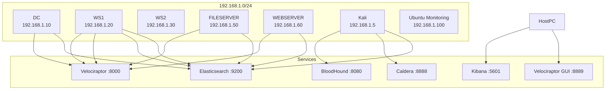

# Network Topology – Nation-State Lab (Advanced Enterprise Simulation)

---

# 1. Physical & Virtual Infrastructure

- **Hypervisor:** VMware Workstation Player 17 (Free Edition)
- **Host Operating System:** Windows 10/11 (16 GB RAM, 500 GB SSD)
- **Guest Virtual Machines:** 7 (initially 8, later reduced to 7 due to disk constraints)
- **Network Isolation:** VMware Host-Only Network (VMnet1)

> No internet access for Windows VMs. Ubuntu VM temporarily used NAT during software installation and updates.

---

# 2. Subnet & IP Addressing

## Network Configuration

| Network | Subnet | Gateway | DHCP | Purpose |
|----------|----------|----------|----------|----------|
| Lab Internal | 192.168.1.0/24 | None (Isolated) | Disabled | VM-to-VM Communication |
| Host-Only (VMnet1) | 192.168.1.0/24 | N/A | Disabled | Complete Network Isolation |

## Static IP Assignment Table

| VM Name | IP Address | Operating System | vCPU | RAM | Disk |
|----------|----------|----------|----------|----------|----------|
| DC (Domain Controller) | 192.168.1.10 | Windows Server 2019 | 2 | 2 GB | 50 GB |
| WS1 (Standard User) | 192.168.1.20 | Windows 10 Pro | 2 | 2 GB | 50 GB |
| WS2 ( developer)    | 192.168.1.30 | Windows 10 Pro | 2 | 2GB  | 30 GB |
| FILESERVER | 192.168.1.50 | Windows Server 2019 | 2 | 2 GB | 50 GB |
| WEBSERVER | 192.168.1.60 | Windows Server 2019 | 2 | 2 GB | 50 GB |
| Kali (Attacker) | 192.168.1.5 | Kali Linux 2024.4 | 2 | 4 GB | 40 GB |
| Ubuntu (Monitoring) | 192.168.1.100 | Ubuntu Server 22.04 | 2 | 4 GB | 60 GB |

**Note:** WS3 (192.168.1.40) were created during the initial phase and later removed due to limited storage capacity.

---

# 3. Virtual Network Adapter Configuration

### Windows Systems & Kali

- Single Host-Only Adapter (VMnet1)

### Ubuntu Monitoring Server

- Adapter 1: Host-Only (VMnet1)
- Adapter 2: NAT (Temporary)

The NAT adapter was used only for:

- Docker image downloads
- Package installation
- Security updates

After deployment, the NAT adapter was removed to restore full isolation.

---

# 4. Services & Ports

## 4.1 Domain Services (DC – 192.168.1.10)

| Service | Port | Protocol | Purpose |
|----------|----------|----------|----------|
| Kerberos | 88 | TCP/UDP | Authentication |
| LDAP | 389 | TCP/UDP | Directory Services |
| SMB/CIFS | 445 | TCP | File Sharing |
| DNS | 53 | TCP/UDP | Domain Resolution |
| Kpasswd | 464 | TCP/UDP | Password Changes |

---

## 4.2 Monitoring Stack (Ubuntu – 192.168.1.100)

| Service | Port | Protocol | Purpose |
|----------|----------|----------|----------|
| Elasticsearch | 9200 | HTTP | Log Storage & Query |
| Kibana | 5601 | HTTP | Dashboard Visualization |
| Velociraptor GUI | 8889 | HTTPS | Threat Hunting Interface |
| Velociraptor Client Communication | 8000 | TCP | Agent Communication |
| Docker API | 2375 | TCP | Disabled / Not Exposed |

---

## 4.3 Attack Platform (Kali – 192.168.1.5)

| Service | Port | Protocol | Purpose |
|----------|----------|----------|----------|
| Caldera | 8888 | HTTP | Red-Team Orchestration |
| Neo4j (BloodHound Backend) | 7474, 7687 | HTTP/Bolt | AD Graph Database |
| BloodHound CE | 8080 | HTTP | Attack Path Visualization |
| Metasploit Handler | 4444, 4445, 8080 | TCP | Reverse Shell Listeners |

---

## 4.4 File & Web Servers

| VM | Service | Port | Description |
|----|----|----|----|
| FILESERVER | SMB Shares | 445 | Documents, Finance, HR |
| WEBSERVER | IIS | 80, 443 | Vulnerable Login.aspx (SQL Injection) |

---

# 5. Communication Flows

### Logging & Monitoring

- Windows Agents → Elasticsearch (TCP 9200)
- Kali Filebeat → Elasticsearch (TCP 9200)
- Velociraptor Clients → Velociraptor Server (TCP 8000)
- Velociraptor GUI → Host Browser (HTTPS 8889)
- Kibana → Elasticsearch (5601 → 9200)

### Attack Operations

- Kali → Windows Systems via SMB (445)
- Kali → Windows Systems via HTTP (8080)
- Reverse Shells → Kali Listeners (4444, 4445, 8080)
- Caldera Agents → Kali C2 (8888)

---

# 6. Firewall & Security Boundaries

## 6.1 Windows Systems

### Base Policy

- Block All Inbound Traffic
- Allow All Outbound Traffic

### Required Outbound Rules

| Port | Purpose |
|--------|--------|
| 9200 | Elasticsearch |
| 8000 | Velociraptor |
| 8888 | Caldera |

### Security Configuration

- Firewall disabled temporarily during troubleshooting
- Re-enabled with application-specific rules
- Microsoft Defender re-enabled after testing

### Defender Exclusions

```text
C:\AtomicRedTeam
C:\Winlogbeat
```

---

## 6.2 Ubuntu Monitoring Host

### UFW Rules

```bash
sudo ufw allow 9200/tcp    # Elasticsearch
sudo ufw allow 5601/tcp    # Kibana
sudo ufw allow 8889/tcp    # Velociraptor GUI
sudo ufw allow 8000/tcp    # Velociraptor Clients
sudo ufw enable
```

### Security Notes

- UFW enabled after installation
- NAT adapter removed after setup
- No inbound internet access permitted

---

## 6.3 Kali Linux

Firewall configuration left at default state.

```bash
iptables -P INPUT ACCEPT
iptables -P OUTPUT ACCEPT
iptables -P FORWARD ACCEPT
```

The attacker machine initiates all communications and does not require additional inbound rules.

---

# 7. File Transfer & Data Exchange

## Primary Method

### VMware Shared Folder

Host Path:

```text
C:\tempshare
```

Mapped Path Inside VMs:

```text
\\vmware-host\Shared Folders\share
```

### Common Files Transferred

- Winlogbeat MSI
- Velociraptor Client MSI
- Atomic Red Team ZIP
- SharpHound ZIP
- shell.exe
- beacon.exe

---

## Alternate Method

### Kali HTTP Server

```bash
python3 -m http.server 8080
```

Used for payload delivery and file transfers from Kali to Windows systems.

---

# 8. Network Diagram



---

# 9. Evolution of the Topology

## Initial State

8 Virtual Machines

- DC
- WS1
- WS2
- FILESERVER
- WEBSERVER
- Kali
- Ubuntu

---

## Mid-Project Changes

Due to storage limitations:

- WS2 removed

All agents and logs associated with these systems were removed.

No impact on attack simulation capabilities.

---

## Final State

6 Virtual Machines

- DC
- WS1
- ws2
- FILESERVER
- WEBSERVER
- Kali
- Ubuntu

All monitoring services centralized on Ubuntu.

---

# 10. Achieved Security Posture

## Isolation

- No VM can access the internet
- No VM can access the host LAN
- All systems remain within the Host-Only segment

---

## Visibility

Centralized telemetry includes:

- Windows Security Logs
- Sysmon Logs
- Kali Syslog Events
- Velociraptor Telemetry
- Winlogbeat Events

All logs are indexed in Elasticsearch and visualized through Kibana.

---

## Attack Surface

The environment contains:

- Active Directory Domain
- Domain Controller
- Domain-Joined Workstation
- File Shares
- Vulnerable Web Application
- Red Team Infrastructure

---

## Detection Coverage

Custom Kibana detections were developed for:

| MITRE ATT&CK ID | Technique |
|---------------|-----------|
| T1203 | Exploitation for Client Execution |
| T1053.005 | Scheduled Task |
| T1548.002 | UAC Bypass |
| T1003.001 | LSASS Credential Dumping |
| T1550.002 | Pass-the-Hash |
| T1071.001 | Web Protocol Communications |

---

# Conclusion

The final lab consisted of six fully operational virtual machines connected through an isolated Host-Only network. Centralized monitoring was achieved using Elasticsearch, Kibana, and Velociraptor. The environment successfully supported realistic Active Directory attack simulations, endpoint telemetry collection, threat hunting, and MITRE ATT&CK-based detection engineering while remaining completely isolated from external networks.

The topology remained stable throughout the project lifecycle and was validated through execution of a complete Advanced Persistent Threat (APT) attack chain simulation.