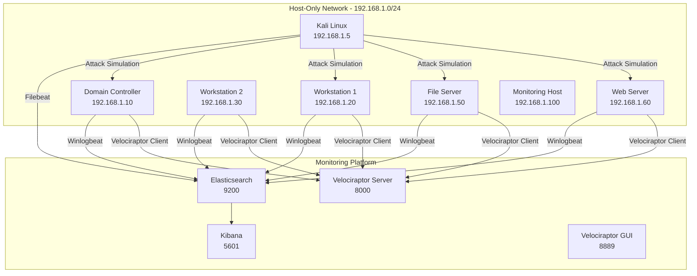

# Architecture Overview – Nation-State Lab

## Overview

The **Nation-State Lab** is a controlled cyber range designed to emulate a modern enterprise environment for adversary simulation, detection engineering, incident response, and threat hunting. The environment combines a Microsoft Active Directory infrastructure with centralized monitoring, endpoint telemetry, and attack simulation platforms to provide end-to-end visibility across the attack lifecycle.

The lab enables realistic execution of advanced attack techniques while providing defenders with the tools required to detect, investigate, and respond to malicious activity.

---

# High-Level Architecture



---

# Network Design

## Network Segmentation

The environment operates within a dedicated VMware Host-Only network using the subnet:

```text
192.168.1.0/24
```

### Design Objectives

* Fully isolated from production and internet-facing networks
* Safe execution of offensive security tools and malware simulations
* Controlled communication between infrastructure components
* Repeatable testing and incident response exercises

### Connectivity Model

| Network Component      | Connectivity                     |
| ---------------------- | -------------------------------- |
| Windows Infrastructure | Internal only                    |
| Kali Linux             | Internal only                    |
| Monitoring Platform    | Internal only                    |
| Internet Access        | Disabled after deployment        |
| Host Access            | Limited to management interfaces |

---

# Infrastructure Components

## Active Directory Environment

### Domain Controller (DC)

| Attribute         | Value                                 |
| ----------------- | ------------------------------------- |
| IP Address        | 192.168.1.10                          |
| Operating System  | Windows Server 2019                   |
| Primary Functions | Active Directory, DNS, Authentication |
| Security Agents   | Winlogbeat, Velociraptor              |

Responsibilities:

* Identity management
* Kerberos authentication
* Group Policy distribution
* Domain administration

---

### Workstations

| Host | IP Address   | Operating System | Purpose                |
| ---- | ------------ | ---------------- | ---------------------- |
| WS1  | 192.168.1.20 | Windows 10 Pro   | Primary attack target  |
| WS2  | 192.168.1.30 | Windows 10 Pro   | Additional workstation |

Installed Components:

* Winlogbeat
* Velociraptor Client
* Microsoft Defender

---

### File Server

| Attribute        | Value                                      |
| ---------------- | ------------------------------------------ |
| IP Address       | 192.168.1.50                               |
| Operating System | Windows Server 2019                        |
| Purpose          | Shared storage and lateral movement target |

Hosted Shares:

* Documents
* Finance
* Human Resources

---

### Web Server

| Attribute        | Value               |
| ---------------- | ------------------- |
| IP Address       | 192.168.1.60        |
| Operating System | Windows Server 2019 |
| Service          | IIS Web Server      |

Purpose:

* Web application testing
* Initial access simulations
* Vulnerability exploitation scenarios

---

# Attack Infrastructure

## Kali Linux Platform

| Attribute        | Value                        |
| ---------------- | ---------------------------- |
| IP Address       | 192.168.1.5                  |
| Operating System | Kali Linux 2024.4            |
| Role             | Adversary Emulation Platform |

### Installed Tooling

| Category            | Tools                |
| ------------------- | -------------------- |
| Reconnaissance      | Nmap                 |
| Credential Attacks  | Hydra, Responder     |
| Exploitation        | Metasploit Framework |
| Lateral Movement    | Impacket             |
| Adversary Emulation | Caldera              |
| AD Enumeration      | BloodHound CE        |
| Log Collection      | Filebeat             |

### Capabilities

* Network reconnaissance
* Payload generation
* Reverse shell handling
* Credential harvesting
* Lateral movement simulation
* Command and control operations

---

# Monitoring Architecture

## Elastic Stack

The Elastic platform provides centralized logging, analytics, detection engineering, and visualization capabilities.

### Elasticsearch

| Attribute  | Value                    |
| ---------- | ------------------------ |
| Version    | 8.14.0                   |
| Port       | 9200                     |
| Deployment | Docker                   |
| Function   | Log indexing and storage |

### Kibana

| Attribute  | Value                      |
| ---------- | -------------------------- |
| Version    | 8.14.0                     |
| Port       | 5601                       |
| Deployment | Docker                     |
| Function   | Visualization and alerting |

### Winlogbeat

Installed on:

* Domain Controller
* Workstations
* File Server
* Web Server

Collected Logs:

* Security
* System
* Application

### Filebeat

Installed on:

* Kali Linux

Collected Logs:

* `/var/log/syslog`
* `/var/log/auth.log`

---

# Endpoint Visibility Platform

## Velociraptor

Velociraptor provides endpoint visibility, threat hunting, forensic collection, and incident response capabilities.

### Server Configuration

| Component   | Value                    |
| ----------- | ------------------------ |
| Host        | Ubuntu Monitoring Server |
| Client Port | 8000                     |
| GUI Port    | 8889                     |
| Deployment  | Native Binary            |

### Client Deployment

Installed on:

* Domain Controller
* Workstations
* File Server
* Web Server

### Common Hunting Artifacts

| Artifact                   | Purpose               |
| -------------------------- | --------------------- |
| Windows.System.Pslist      | Process enumeration   |
| Windows.Sys.ScheduledTasks | Persistence detection |
| Windows.EventLogs.Security | Event log analysis    |
| Windows.Search.FileFinder  | IOC discovery         |

---

# Data Flow Architecture

## Telemetry Pipeline

```text
Windows Endpoints
        │
        ▼
   Winlogbeat
        │
        ▼
 Elasticsearch
        │
        ▼
     Kibana
```

## Linux Telemetry Pipeline

```text
Kali Linux
     │
     ▼
  Filebeat
     │
     ▼
Elasticsearch
     │
     ▼
   Kibana
```

## Threat Hunting Pipeline

```text
Windows Endpoints
        │
        ▼
Velociraptor Client
        │
        ▼
Velociraptor Server
        │
        ▼
Hunts & Investigations
```

---

# Security Architecture

## Trust Boundaries

The lab intentionally relaxes certain security controls to facilitate adversary emulation and detection testing.

### Lab Configuration

* Host-only network isolation
* Windows Defender exclusions for testing
* Limited firewall restrictions
* No external network exposure
* Centralized monitoring enabled

### Production Enhancements

Recommended improvements include:

* TLS encryption
* Role-Based Access Control (RBAC)
* Multi-Factor Authentication (MFA)
* Endpoint hardening
* Network segmentation
* Security monitoring at scale

---

# Operational Workflow

The environment supports the complete cyber defense lifecycle:

1. Attack simulation from Kali Linux
2. Telemetry collection via Beats
3. Log aggregation in Elasticsearch
4. Alert generation in Kibana
5. Threat hunting using Velociraptor
6. Incident response and containment
7. Recovery and forensic analysis

---

# Key Service Ports

| Port | Service                           | Host                            |
| ---- | --------------------------------- | ------------------------------- |
| 9200 | Elasticsearch                     | Ubuntu Monitoring Host          |
| 5601 | Kibana                            | Ubuntu Monitoring Host          |
| 8000 | Velociraptor Client Communication | Ubuntu Monitoring Host          |
| 8889 | Velociraptor Web Interface        | Ubuntu Monitoring Host          |
| 8888 | Caldera                           | Kali Linux                      |
| 8080 | BloodHound CE                     | Kali Linux                      |
| 4444 | Metasploit Listener               | Kali Linux                      |
| 445  | SMB                               | Domain Controller / File Server |
| 80   | IIS Web Server                    | Web Server                      |

---

# Architectural Benefits

The Nation-State Lab architecture provides:

* Realistic enterprise Active Directory infrastructure
* Full attack lifecycle simulation
* Centralized security monitoring
* Detection engineering validation
* Threat hunting capabilities
* Incident response exercises
* Repeatable purple-team operations
* Reproducible research environment

---

# Conclusion

The Nation-State Lab delivers a complete enterprise security testing environment that integrates Active Directory, offensive security tooling, centralized logging, endpoint telemetry, threat hunting, and incident response capabilities. The architecture enables realistic adversary simulations while maintaining comprehensive visibility across all stages of the attack lifecycle, making it suitable for cybersecurity training, research, detection engineering, and purple-team exercises.
