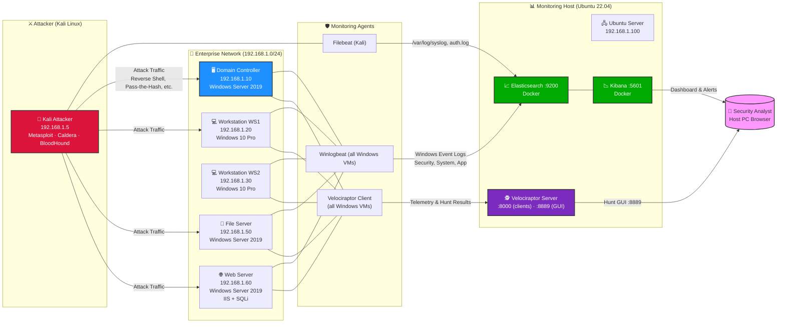

# 🛡️ Nation-State Attack Simulation & Detection Lab
**Advanced Enterprise Cyber Range for APT Simulation, Threat Detection & DFIR Operations**

---

## 📝 1. Executive Summary

The **Nation-State Attack Simulation & Detection Lab** is an enterprise-grade cyber range engineered to emulate multi-stage Advanced Persistent Threat (APT) campaigns while simultaneously validating detection engineering, threat hunting, digital forensics, and incident response (DFIR) capabilities.

In a landscape where legacy signature-based defenses fail against Living-off-the-Land (LotL) binaries and sophisticated lateral movement, security operations demand high-fidelity, deterministic environments. This platform recreates a realistic Active Directory enterprise domain where adversary behaviors are executed, monitored, detected, investigated, and mapped to the MITRE ATT&CK® framework.

---

## 🎯 2. Project Objective

Primary Strategic Outcomes:

- Simulate nation-state attack techniques across full lifecycle
- Build detection-as-code content (KQL + Sigma)
- Validate SIEM pipelines (Endpoint → Elastic → Kibana)
- Develop threat hunting workflows using Velociraptor VQL
- Standardize DFIR investigation and timeline reconstruction
- Measure MITRE ATT&CK coverage
- Build SOC dashboards for real-time analysis

---

## 🏗️ 3. Architecture

---

## 🔄 4. Security Pipeline

Attack Simulation → Endpoint Execution → Sysmon Logs → Beat Collection → Elastic Ingestion → Detection Rules → Alerts → SOC Triage → Threat Hunting → DFIR Investigation → IOC Extraction → Incident Report

---

## 🚀 5. Key Features

- Multi-stage APT simulation (Recon → C2)
- Credential dumping simulation (LSASS / NTDS)
- Lateral movement (Pass-the-Hash, SMB, WinRM)
- Persistence mechanisms (registry, tasks, services)
- KQL + Sigma detection engineering
- MITRE ATT&CK mapping engine
- Kibana SOC dashboards
- Velociraptor threat hunting
- DFIR timeline reconstruction

---

## 🎯 6. Attack Lifecycle Mapping

Phase | Objective | Detection Focus
Reconnaissance | Network discovery | Scan anomalies
Initial Access | Foothold | Ingress alerts
Persistence | Maintain access | Autoruns detection
Privilege Escalation | Admin access | Token anomalies
Credential Access | Theft | LSASS monitoring
Lateral Movement | Spread | SMB/WinRM logs
Command & Control | Communication | Beacon detection

---

## 📁 7. Repository Structure

nation-state-lab/
├── README.md
├── PROJECT-OVERVIEW.md
├── ARCHITECTURE.md
├── QUICK-START-GUIDE.md
├── LICENSE
├── CONTRIBUTING.md
├── .gitignore
│
├── 01-INFRASTRUCTURE/
│   ├── network-topology.md
│   ├── vm-configuration.md
│   ├── network-diagram.png
│   ├── ip-addressing-table.csv
│
├── 02-ACTIVE-DIRECTORY-SETUP/
│   ├── dc-configuration.md
│   ├── domain-structure.md
│   ├── user-accounts.md
│   ├── group-policy.md
│   ├── audit-policies.md
│
├── 03-MONITORING-STACK/
│   ├── elasticsearch-setup.md
│   ├── kibana-installation.md
│   ├── winlogbeat-config.md
│   ├── filebeat-config.md
│   ├── velociraptor-setup.md
│   ├── docker-compose.yml
│   ├── troubleshooting.md
│
├── 04-ATTACK-TOOLS/
│   ├── metasploit-setup.md
│   ├── caldera-deployment.md
│   ├── bloodhound-setup.md
│   ├── atomic-red-team.md
│   ├── impacket-tools.md
│   └── installation-scripts/
│       ├── install-kali-tools.sh
│       ├── install-elastic.sh
│       ├── install-winlogbeat.ps1
│
├── 05-ATTACK-EXECUTION/
│   ├── attack-chain-overview.md
│   ├── phase-1-reconnaissance.md
│   ├── phase-2-initial-access.md
│   ├── phase-3-persistence.md
│   ├── phase-4-privilege-escalation.md
│   ├── phase-5-credential-dumping.md
│   ├── phase-6-lateral-movement.md
│   ├── phase-7-command-control.md
│   ├── evidence/
│
├── 06-DETECTION-ENGINEERING/
│   ├── detection-overview.md
│   ├── kibana-dashboards.md
│   ├── alert-rules.md
│   ├── detection-rules/
│       ├── reverse-shell.kql
│       ├── persistence.kql
│       ├── uac-bypass.kql
│       ├── credential-access.kql
│       ├── lateral-movement.kql
│       ├── c2-beacon.kql
│
├── 07-THREAT-HUNTING/
│   ├── velociraptor-hunts.md
│   ├── hunting-playbook.md
│   ├── vql-queries/
│       ├── process.vql
│       ├── network.vql
│       ├── registry.vql
│
├── 08-FORENSICS/
│   ├── incident-response.md
│   ├── timeline.md
│   ├── memory-forensics.md
│
├── 09-MITRE-ATT&CK/
│   ├── attack-mapping.md
│   ├── heatmap.png
│
├── 10-INCIDENT-REPORT/
│   ├── report.md
│   ├── executive-summary.md
│
├── 11-DASHBOARD/
│   ├── dashboard.ndjson
│
├── 12-SCRIPTS/
│   ├── setup.sh
│   ├── install.ps1
│
├── 13-DOCUMENTATION/
│   ├── troubleshooting.md
│
├── 14-LEARNING-RESOURCES/
│   ├── mitre.md
│
├── 15-TOOLS/
│   ├── versions.md
│
└── assets/

---

## 🛠️ 8. Technology Stack

- CALDERA, Metasploit, Atomic Red Team
- Elasticsearch, Kibana, Sysmon
- Winlogbeat, Filebeat
- Velociraptor
- Python, PowerShell, Bash, Docker

---

## 📊 9. Metrics

- 7 Attack Phases
- 100+ Detection Rules
- 50+ Sigma Rules
- 50+ Threat Hunts
- 100+ MITRE Mappings
- 1000+ Logs Processed

---

## 🧠 10. Skills Demonstrated

- SOC Operations
- Detection Engineering
- Threat Hunting
- DFIR
- Active Directory Security
- SIEM Architecture

---

---

## 👤 12. Author

Bommali Mallesu  
Cybersecurity Engineer | SOC Analyst | Threat Hunter  