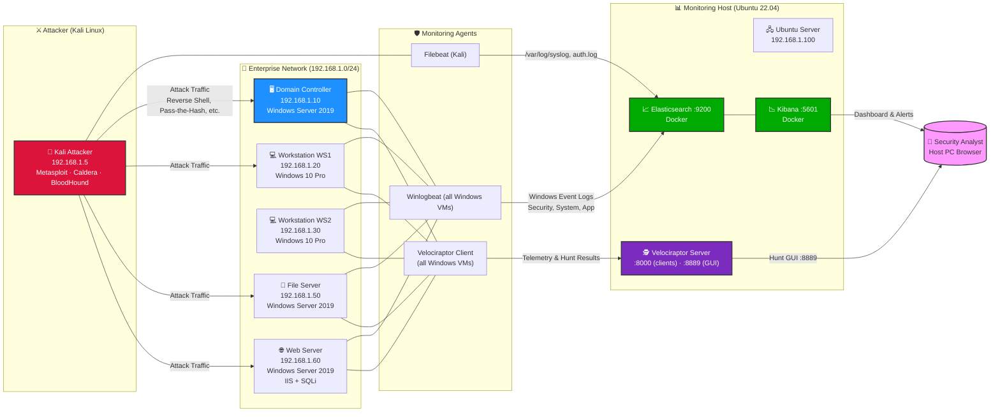
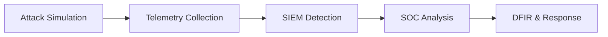

<div align="center">

# 🛡️ Nation-State Attack Simulation & Detection Lab
**Advanced Enterprise Cyber Range for APT Simulation, Threat Detection & DFIR Operations**

[](#)
[](https://attack.mitre.org/)
[](#)
[](LICENSE)

</div>

---

## 📝 1. Executive Summary

The **Nation-State Attack Simulation & Detection Lab** is an enterprise-grade cyber range engineered to emulate multi-stage Advanced Persistent Threat (APT) campaigns while simultaneously validating detection engineering, threat hunting, digital forensics, and incident response (DFIR) capabilities.

In a landscape where legacy signature-based defenses fail against Living-off-the-Land (LotL) binaries and sophisticated lateral movement, security operations demand high-fidelity, deterministic environments. This platform recreates a realistic Active Directory enterprise domain where adversary behaviors are executed, monitored, detected, investigated, and mapped to the MITRE ATT&CK® framework.

---
## 📋2. Prerequisites

- VMware Workstation Player (free) or Pro
- 16 GB RAM host, 100 GB free disk space
- ISOs: Windows Server 2019, Windows 10 Pro, Kali Linux 2024.4, Ubuntu Server 22.04
- Basic familiarity with Windows Server, AD, and Linux command line

---
## 🎯 3. Project Objective

Primary Strategic Outcomes:

- Simulate nation-state attack techniques across full lifecycle
- Build detection-as-code content (KQL + Sigma)
- Validate SIEM pipelines (Endpoint → Elastic → Kibana)
- Develop threat hunting workflows using Velociraptor VQL
- Standardize DFIR investigation and timeline reconstruction
- Measure MITRE ATT&CK coverage
- Build SOC dashboards for real-time analysis

---

## 🏗️ 4. Architecture


---

## 🔄 5. Security Pipeline



---

## 🚀 6. Key Features


- Credential dumping – LSASS memory extraction (Mimikatz), NTDS.dit, and hash caching

- Lateral movement – Pass‑the‑Hash, PSExec, WMI, WinRM, SMB, RDP

- Persistence mechanisms – Scheduled tasks, registry run keys, services, startup folders

- Detection engineering – Custom Kibana (KQL) rules + Sigma rules for SIEM portability

- MITRE ATT&CK mapping – Every technique mapped to tactic, ID, and detection logic

- Kibana SOC dashboards – Active agents, severity metrics, top alerts, event timelines

- Velociraptor‑based threat hunting – VQL hunts for processes, scheduled tasks, event logs, and file artefacts

- DFIR timeline reconstruction – Correlation of attacker steps from initial access to domain compromise

- Sysmon event telemetry – Detailed process, network, and LSASS access logging

- Offline air‑gapped installation – No internet required for agent deployment or attack execution


---

## 🎯 7. Attack Lifecycle Mapping

| Phase | Objective | Detection Focus |
|---------|-----------|------------------|
| Reconnaissance | Network discovery and environment enumeration | Network scanning anomalies, host discovery activity |
| Initial Access | Establish an initial foothold in the target environment | Ingress tool transfer, suspicious authentication events |
| Persistence | Maintain long-term access to compromised systems | Autoruns, scheduled tasks, registry modifications |
| Privilege Escalation | Obtain elevated or administrative privileges | Token manipulation, privilege escalation anomalies |
| Credential Access | Steal credentials and authentication material | LSASS access, credential dumping activity |
| Lateral Movement | Move between systems within the network | SMB, WinRM, RDP, and remote execution monitoring |
| Command & Control | Establish communication with attacker infrastructure | Beaconing patterns, suspicious outbound connections |

---

## 📁 8. Project Structure

```text
nation-state-lab/
│
├── 📄 README.md
├── 📄 PROJECT-OVERVIEW.md
├── 📄 ARCHITECTURE.md
├── 📄 QUICK-START-GUIDE.md
│
├── 📂 01-INFRASTRUCTURE/
│   ├── network-topology.md
│   ├── vm-configuration.md
│   ├── network-diagram.png
│   └── ip-addressing-table.csv
│
├── 📂 02-ACTIVE-DIRECTORY-SETUP/
│   ├── dc-configuration.md
│   ├── domain-structure.md
│   ├── user-accounts.md
│   ├── group-policy.md
│   └── audit-policies.md
│
├── 📂 03-MONITORING-STACK/
│   ├── elasticsearch-setup.md
│   ├── kibana-installation.md
│   ├── winlogbeat-config.md
│   ├── filebeat-config.md
│   ├── velociraptor-setup.md
│   ├── docker-compose.yml
│   └── troubleshooting.md
│
├── 📂 04-ATTACK-TOOLS/
│   ├── metasploit-setup.md
│   ├── caldera-deployment.md
│   ├── bloodhound-setup.md
│   ├── atomic-red-team.md
│   ├── impacket-tools.md
│   └── installation-scripts/
│
├── 📂 05-ATTACK-EXECUTION/
│   ├── attack-chain-overview.md
│   ├── phase-1-reconnaissance.md
│   ├── phase-2-initial-access.md
│   ├── phase-3-persistence.md
│   ├── phase-4-privilege-escalation.md
│   ├── phase-5-credential-dumping.md
│   ├── phase-6-lateral-movement.md
│   ├── phase-7-command-control.md
│   └── evidence/
│
├── 📂 06-DETECTION-ENGINEERING/
│   ├── detection-overview.md
│   ├── kibana-dashboards.md
│   ├── alert-rules.md
│   ├── detection-metrics.md
│   └── detection-rules/
│
├── 📂 07-THREAT-HUNTING/
│   ├── threat-hunting-overview.md
│   ├── threat-hunting-playbook.md
│   ├── velociraptor-hunts.md
│   └── vql-queries/
│
├── 📂 08-FORENSICS/
│   ├── incident-response-overview.md
│   ├── event-log-analysis.md
│   ├── memory-forensics.md
│   ├── timeline-reconstruction.md
│   ├── ioc-extraction.md
│   └── artifacts/
│
├── 📂 09-MITRE-ATT&CK/
│   ├── framework-overview.md
│   ├── attack-mapping.md
│   ├── tactic-technique-table.md
│   └── detailed-mappings/
│
├── 📂 10-INCIDENT-REPORT/
│   ├── INCIDENT-REPORT.md
│   ├── executive-summary.md
│   ├── technical-analysis.md
│   ├── findings-summary.md
│   └── recommendations.md
│
├── 📂 11-DASHBOARD-CONFIG/
│   ├── dashboard-export.ndjson
│   ├── dashboard-guide.md
│   ├── visualization-guide.md
│   └── dashboard-screenshots/
│
├── 📂 12-SCRIPTS/
│   ├── lab-setup.sh
│   ├── install-docker-elastic.sh
│   ├── generate-payload.sh
│   └── troubleshooting-script.sh
│
├── 📂 13-DOCUMENTATION/
│   ├── TROUBLESHOOTING.md
│   ├── BEST-PRACTICES.md
│   ├── SECURITY-HARDENING.md
│   ├── PERFORMANCE-OPTIMIZATION.md
│   └── FAQ.md
│
├── 📂 14-LEARNING-RESOURCES/
│   ├── MITRE-ATTACK-Guide.md
│   ├── Cyber-Kill-Chain.md
│   ├── Incident-Response-Framework.md
│   ├── Detection-Engineering-Guide.md
│   └── Threat-Hunting-Methodology.md
│
├── 📂 15-TOOLS-VERSION-REFERENCE/
│   ├── tools-versions.md
│   └── compatibility-matrix.md
│
├── 📂 assets/
│   ├── banners/
│   ├── diagrams/
│   ├── screenshots/
│   └── logos/
│
├── LICENSE
├── CONTRIBUTING.md
└── .gitignore
```

---

## 🛠️ 9. Technology Stack

| Category | Tools | Purpose |
|----------|------|---------|
| ⚔️ Adversary Emulation | CALDERA, Metasploit, Atomic Red Team | Simulate real-world attacker behaviors aligned with MITRE ATT&CK |
| 📊 SIEM & Log Analytics | Elasticsearch, Kibana | Centralized log ingestion, search, and security visualization |
| 🧩 Endpoint Telemetry | Sysmon | Advanced Windows event logging for deep system visibility |
| 📡 Log Collection Agents | Winlogbeat, Filebeat | Forward endpoint and system logs to SIEM platform |
| 🕵️ DFIR & Threat Hunting | Velociraptor | Endpoint investigation, live response, and forensic hunting |
| 🧠 Automation & Scripting | Python, PowerShell, Bash | Detection engineering, automation, and security workflow scripting |
| 🐳 Infrastructure | Docker | Containerized deployment of security tools and services |

---

## 📊 10. Metrics

- 7 Attack Phases
- 100+ Detection Rules
- 50+ Sigma Rules
- 50+ Threat Hunts
- 100+ MITRE Mappings
- 1000+ Logs Processed

---

## 🧠 11. Skills Demonstrated

- SOC Operations
- Detection Engineering
- Threat Hunting
- DFIR
- Active Directory Security
- SIEM Architecture

---
> **⚠️ Legal & Security Notice**  
> This lab is for **educational and authorised testing only**. Do not deploy any attack techniques against systems without explicit written permission. The author is not responsible for any misuse.
---

## 👤 12. Author

Bommali Mallesu  
Cybersecurity Engineer | SOC Analyst | Threat Hunter  